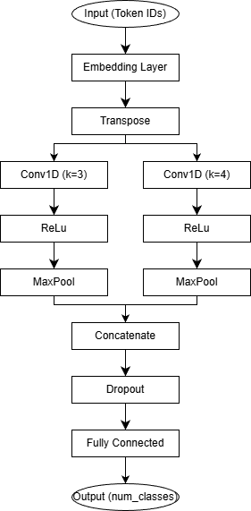
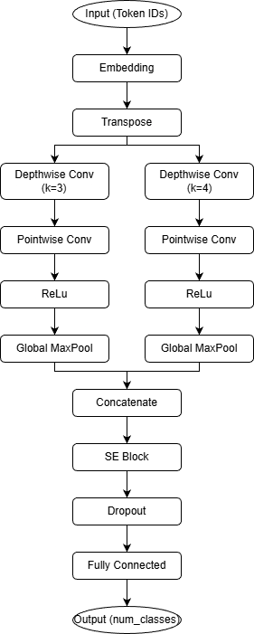

# TikTok Comment Sentiment Analysis Using TextCNN

<!-- This is the short explanation about the title of the project. -->

## Project Overview

This project is a Final Project that implements a TextCNN to perform sentiment analysis on TikTok comments in Indonesian language. The system is designed to classify comments into two categories: Cyberbullying (insult/embarrass content comments) and Non-Cyberbullying (normal/clear content comments).

**Institution**: Institut Teknologi Sumatera (ITERA)  
**Study Program**: Informatics Engineering  
**Author**: Nikola Arinanda  
**Year**: 2026

---

## Abstract

This project uses TextCNN architecture to analyze YouTube comments sentiment. Initially, the data will go through preprocessing stages such as data division (80:20), case folding, text cleaning, augmentation (AEDA, random swap character, random delete character), tokenization and stopword removal to prepare the data. The next step is model training using k-fold cross-validation as many as 5 fold to ensure robustness and good generalization. Final step is model evaluation using confussion matrix such as accuracy, precision, recall and F1 score.

---

## Project Structure

<!-- <pre> -->

```bash
tugas-akhir-main/
├── dataset/
│ ├── k_fold.json           # k-fold cross-validation dictionary
│ └── cyberbullying.csv     # Original dataset
├── code/
│ ├── datareader.py         # Data loader and preprocessing
│ ├── model.py              # Model architecture
│ └── train.py              # Main script for model training
├── model_outputs/
│ ├── run_YYYYMMDD_HHMMSS/
│ │ ├── fold_1_model.pth    # Model output
│ │ ├── fold_2_model.pth    # ...
│ │ ├── fold_3_model.pth
│ │ ├── fold_4_model.pth
│ │ ├── fold_5_model.pth
│ │ └── ...
│ └── ...
└── report/
│ └── thesis.pdf            # Documentation and reports
└── requirements.txt        # Python dependencies
```

<!-- </pre> -->

---

## Environment Setup

### Prerequisites

This project requires:

- Python: 3.8 or higher (tested with Python 3.9+)
- CUDA: Optional (for GPU acceleration)

### System Requirements

- RAM: Minimum 8 GB (recommended 16 GB)
- Storage: Minimum 10 GB (for model and dataset)
- GPU: Optional, but highly recommended for faster training

---

## Dependencies

All dependencies are listed in the `requirements.txt` file. Main libraries:

```bash
| Library        | Version  | Purpose                              |
|----------------|----------|--------------------------------------|
| torch          | >=2.0.0  | Deep learning framework              |
| pandas         | >=1.5.0  | Data manipulation                    |
| numpy          | >=1.23.0 | Numerical computing                  |
| matplotlib     | >=3.7.0  | Data visualization                   |
| seaborn        | >=0.12.0 | Statistical visualization            |
| scikit-learn   | >=1.2.0  | Machine learning utilities           |
| transformers   | >=4.30.0 | NLP models (IndoBERT, etc.)          |
| nltk           | >=3.8.0  | Text preprocessing                   |
| tqdm           | >=4.65.0 | Progress bar                         |
| wandb          | >=0.15.0 | Experiment tracking                  |
```

For the complete list, see `requirements.txt`

---

## Installation & Setup

### Step 1: Clone Repository

```bash
git clone https://github.com/nikolaarinanda/tugas-akhir.git
cd tugas-akhir
```

### Step 2: Create Virtual Environment

It is highly recommended to use a virtual environment to avoid dependency conflicts.
**Using venv (built-in python)**:

```bash
# Linux/Mac
python3 -m venv venv
source venv/bin/activate

# Windows
python -m venv venv
venv\Scripts\activate
```

**Using conda**:

```bash
conda create -n youtube-sentiment python=3.9
conda activate youtube-sentiment
```

### Step 3: Install Dependencies

```bash
# Upgrade pip to the latest version
pip install --upgrade pip

# Install all requirements
pip install -r requirements.txt
```

**Note for PyTorch with GPU**: If you want to use GPU, install the CUDA-specific version of PyTorch:

```bash
# For CUDA 11.8
pip install torch torchvision torchaudio --index-url https://download.pytorch.org/whl/cu118

# For CUDA 12.1
pip install torch torchvision torchaudio --index-url https://download.pytorch.org/whl/cu121
```

---

## Dataset Information

The dataset consists of TikTOk comments in Indonesian language which comes from [this](https://ieeexplore.ieee.org/document/10468424) research with labels:

- Cyberbullying (-1): Insult/embarrass content comments
- Non-cyberbullying (1): Normal/clear content comments

### Dataset Format

The dataset `cyberbullying.csv` has the following columns:

| Column    | Type    | Description                                   |
| --------- | ------- | --------------------------------------------- |
| sentiment | Integer | label (-1 cyberbullying, 1 non-cyberbullying) |
| comment   | String  | Comment content                               |

---

## Model Architecture

### TextCNN Text Classifier



### SEDepthwise TextCNN Text Classifier



## Key Components:

- **Embedding**: Converts token IDs into dense vectors (IndoBERT tokenizer compatible)
- **Transpose**: Adjusts tensor shape for Conv1D input (embedding_dim → channel dimension)
- **Depthwise Separable Convolution**:
  - Depthwise Conv (kernel sizes = 3, 4)
  - Pointwise Conv (channel mixing)
- **Activation**: ReLU for non-linearity
- **Pooling**: Global Max Pooling to extract dominant features
- **Concatenation**: Combines features from multiple convolution branches
- **SE Block (Squeeze-and-Excitation)**: Channel-wise attention to recalibrate feature importance
- **Output Layer**: Fully connected layer for classification (num_classes)

---

## How to Run

### 1. Training With Default COnfiguration

```bash
py train.py
```

Result:

- Create fold indices as manys as 5 fold using k-fold cross-validation (if it doesn't exist yet)
- Training model Training model on 5 folds sequentially
- Save the training result model in model_outputs/run_YYYYMMDD_HHMMSS/
- Metrics plot and model checkpoints in Wandb

### 2. Training dengan custom parameter

```bash
python train.py \
    --max_length 128 \
    --dropout 0.3 \
    --batch_size 50 \
    --optimizer_name Muon \
    --embed_dim 100 \
    --conv_filters 50 \
    --kernel_size 3 4 \
    --epochs 100 \
    --lr 5e-4 \
```

### Command Line Arguments

| Argument       | Type  | Default                          | Description                                                       |
| -------------- | ----- | -------------------------------- | ----------------------------------------------------------------- |
| --seed         | int   | 01012001                         | Random seed for reproducibility                                   |
| --dataset_path | str   | '../dataset/cyberbullying.csv'   | Path to dataset file                                              |
| --max_length   | int   | 128                              | Maximum sequence length                                           |
| --tokenizer    | str   | 'indobenchmark/indobert-base-p1' | Tokenizer name                                                    |
| --dropout      | float | 0.5                              | Dropout rate                                                      |
| --batch_size   | int   | 50                               | Batch size for embedding                                          |
| --embed_dim    | int   | 100                              | Embedding dimension for CNN                                       |
| --num_classes  | int   | 2                                | Number of classes                                                 |
| --conv_filters | int   | 50                               | Number of filters for CNN                                         |
| --kernel_size  | int   | [3, 4]                           | Kernel sizes for CNN                                              |
| --n_folds      | int   | 5                                | Fold number for cross-validation                                  |
| --epochs       | int   | 100                              | Number of epochs                                                  |
| --lr           | float | 52-4                             | Learning rate                                                     |
| --output_model | flag  | True                             | Save model after training                                         |
| --output_dir   | str   | 'model_outputs'                  | Directory to save model outputs                                   |
| --use_wandb    | flag  | False                            | Enable Weights & Biases logging                                   |
| --wandb_group  | str   | 'Light TextCNN'                  | Create group for Weights & Biases runs                            |
| --wandb_note   | str   | 'Light TextCNN Note'             | Add Weights & Biases notes                                        |
| --patience     | int   | 5                                | Patience for early stopping (epochs to wait after no improvement) |

---

## Output and Results

### Output Structure

```bash
 model_outputs/
├── run_YYYYMMDD_HHMMSS/
│ ├── fold_1_model.pth    # Model output
│ ├── fold_2_model.pth    # ...
│ ├── fold_3_model.pth
│ └── fold_4_model.pth
│ └── fold_5_model.pth
│ └── ...
└── ...
```

### Wandb Key Matrics

The model produces the following metrics:

- **Accuracy**: Percentage of correct predictions
- **Precision**: Accuracy for positive predictions
- **Recall**: Ability to find all positive samples
- **F1-Score**: Harmonic mean of precision and recall
- **Loss**: Cross-entropy loss

---

## Data Augmentation

Augmentation techniques are applied during training to improve robustness:

- **AEDA (An Easy Data Augmentation)**: augmentation that works by inserting punctuation marks “.”, ”;”, ”?”, ”:”,”!”,”,” randomly into the text
- **Random Swap Character**: Randomly swap positions of two words in the text
- **Random Delete Character**: Randomly delete character from the text\
- **Augmentation Probability**: Default 0.5 (50% of data is selected for augmentation)

Example:

```bash
Original: "makannya segentong buset"
AEDA: "makannya segentong buset!"
Random swap Character: "makannya segetnong buset"
Random delete Character: "makanya segentong buset"
```

---

## Troubleshooting

### Issue: CUDA out of memory

If you encounter issues CUDA out of memory:

```bash
# Reduce batch size
python train.py --batch_size 8

# Reduce embedding dimension
python train.py --embedding_dim 64
```

### Issue: Module not found

If you encounter issues module not found:

```bash
# Make sure virtual environment is activated
# Reinstall dependencies
pip install -r requirements.txt --force-reinstall
```

### Issue: Dataset file not found

If you encounter issues dataset file not found:

- Make sure dataset_youtube_comment.xlsx is in the root directory
- Check file permissions (must be readable)

### Issue: Transformers model cache

If you encounter issues downloading IndoBERT:

```bash
# Manual download
python -c "from transformers import AutoTokenizer; AutoTokenizer.from_pretrained('indobenchmark/indobert-base-p1')"
```

---

## How to Cite

If you use or adapt this code/model in your research or publication, please use one of the following citation formats:

### BibTeX Format

```bash
@thesis{arinanda2026cyberbullying,
  title={Sentiment Analysis of Cyberbullying Comments on TikTok Social Media Using TextCNN Architecture},
  author={Nikola Arinanda},
  year={2026},
  school={Institut Teknologi Sumatera (ITERA)},
  type={Final Project},
  address={Lampung, Indonesia}
}
```

### APA Format

Arinanda, N. (2026). Sentiment Analysis of Cyberbullying Comments on TikTok Social Media Using TextCNN Architecture [Final Project]. Institut Teknologi Sumatera (ITERA).

### MLA Format

Arinanda, Nikola. "Sentiment Analysis of Cyberbullying Comments on TikTok Social Media Using TextCNN Architecture." Final Project, Institut Teknologi Sumatera (ITERA), 2026.

### Chicago Format

Arinanda, Nikola. "Sentiment Analysis of Cyberbullying Comments on TikTok Social Media Using TextCNN Architecture." Final Project, Institut Teknologi Sumatera (ITERA), 2026.

### IEEE Format

N. Arinanda, "Sentiment Analysis of Cyberbullying Comments on TikTok Social Media Using TextCNN Architecture", Final Project, Institut Teknologi Sumatera (ITERA), 2026.

---

## Author Information

- **Name**: Nikola Arinanda
- **Study Program**: Informatics Engineering
- **Institution**: Institut Teknologi Sumatera (ITERA)
- **Year**: 2026
- **Github**: [larinand](https://github.com/larinand)

---

## Contact and Support

For questions or issues about this project, please:

1. Create an issue on the GitHub repository
<!-- Create an issue on the GitHub [repository](https://github.com/mctosima/Tugas_Akhir_Nikola/issues) -->
2. Contact the author via university email
3. See documentation in the laporan/ folder

---

**Last Update**: April 2026
**Status**: Active Development

<!-- This research focuses on TextCNN and modified SEDepthwiseTextCNN for classifying cyberbullying in the TikTok comments dataset. In this study, I improve the accuracy with model modified SEDepthwiseTextCNN compared to previous [research](https://ieeexplore.ieee.org/document/10468424) using same dataset that uses BERT. -->

<!-- For using LaTeX on a desktop computer with VS Code, you can follow [this](https://youtu.be/4lyHIQl4VM8?si=TOYXOIaCTGxaEusH) video. -->
